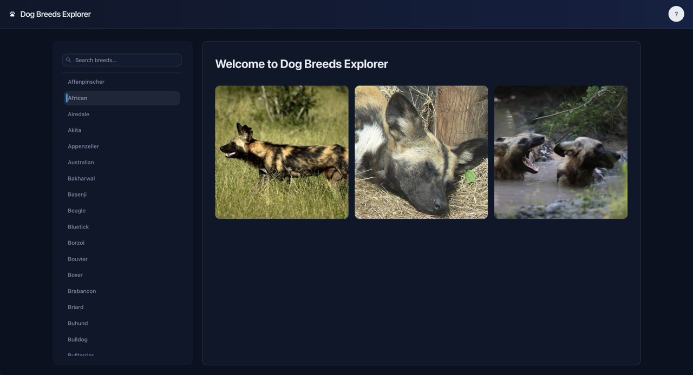
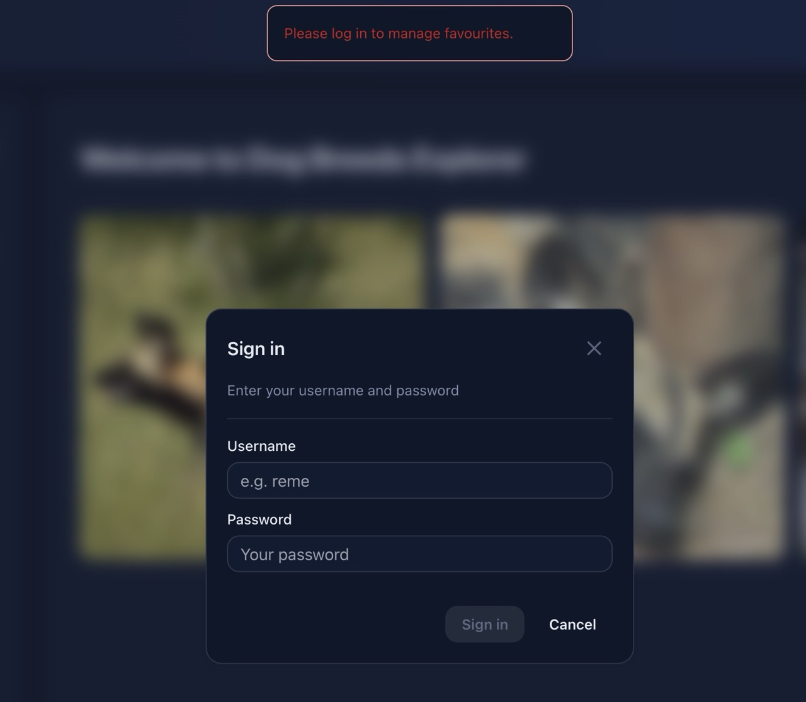
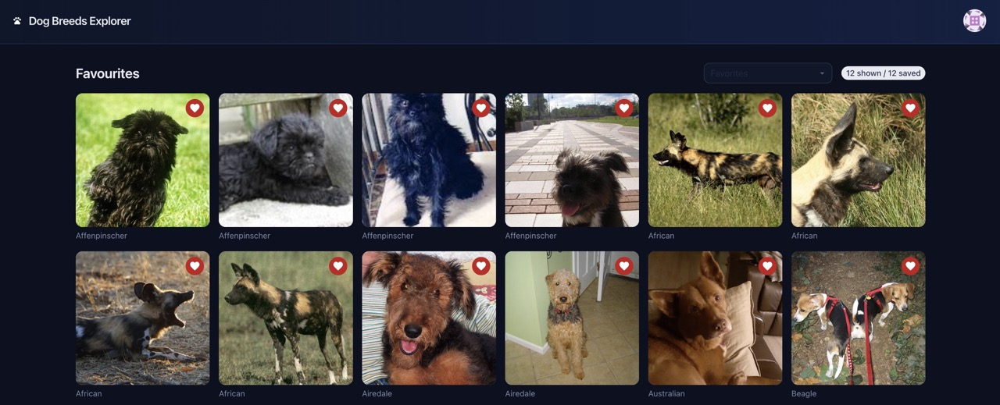

# Dogs API – Full-Stack Assessment

This project is a small full-stack application that allows users to browse dog breeds, view images by breed, and save favourite images.

The primary focus of the project is architecture, data flow, and UI state management, rather than feature breadth.

## How to run the project

### Prerequisites
- Node.js (LTS recommended)
- npm

### Setup

1. Clone the repository
2. From the repository root, install dependencies:
   `npm install`
3. Configure environment variables:
   - Create a `.env` file in the repository root
   - Use `.env.example` as a reference

### Running the application

To run the full project:
`npm start`

Or run applications individually:
`npm run start:api`
`npm run start:web`

### Accessing the application
- Web UI: http://localhost:4200
- API Swagger docs: http://localhost:3000/api/docs

## Tech stack

- Nx – Monorepo tooling
- React (CRA) – Frontend UI
- Joy UI – Component library
- NestJS – Backend API
- SQLite – Lightweight persistence
- SWR – Client-side data fetching and caching

## Project structure

apps/
  api/                  # NestJS backend
  web/                  # React UI
libs/
  shared-interfaces/    # Shared TypeScript contracts

A shared library is used for interfaces so that both the API and UI rely on the same data contracts.

## Design and architectural notes

### Monorepo
Nx was chosen to manage the API, UI, and shared libraries within a single repository. This keeps boundaries explicit while allowing shared types and utilities without duplication.

### API design
The API is responsible for:
- Fetching dog breed data and images
- Managing favourite images per user
- Abstracting external APIs away from the client

### Caching
In-memory caching is used on the backend to reduce unnecessary calls to third-party APIs.

### Persistence
SQLite is used for simplicity to persist user data and favourite images.

### Authentication
A minimal authentication flow is included only to support associating favourites with a user and is not intended to be production-ready.

## Features

### API
- Fetch all dog breeds
- Fetch images by breed
- Add / remove favourite images
- Retrieve a user’s favourite images

### UI
Users can:
- Browse dog breeds
- View images for a selected breed
- Save images as favourites
- View and manage favourite images after logging in

## Screenshots

**Main landing page with breed selected.**

**Adding a favourite before logging in.**

**Viewing favourites after logging in.**

**Authenticated user menu.**

